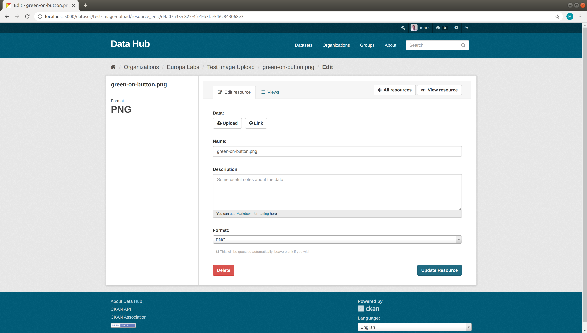
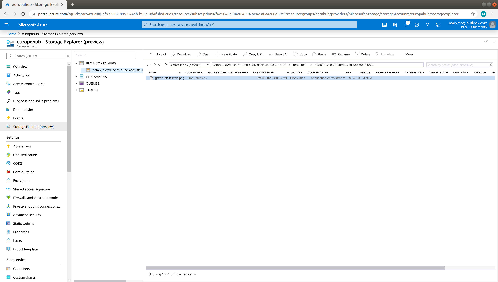
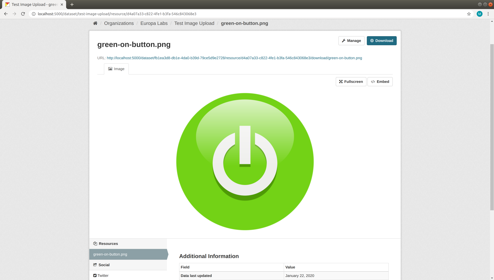

.. image:: https://travis-ci.org/markmo/ckanext-azurefilestore.svg?branch=master
    :target: https://travis-ci.org/markmo/ckanext-azurefilestore

.. image:: https://coveralls.io/repos/markmo/ckanext-azurefilestore/badge.svg
  :target: https://coveralls.io/r/markmo/ckanext-azurefilestore

..  .. image:: https://pypip.in/download/ckanext-azurefilestore/badge.svg
        :target: https://pypi.python.org/pypi//ckanext-azurefilestore/
        :alt: Downloads

..  .. image:: https://pypip.in/version/ckanext-azurefilestore/badge.svg
        :target: https://pypi.python.org/pypi/ckanext-azurefilestore/
        :alt: Latest Version

..  .. image:: https://pypip.in/py_versions/ckanext-azurefilestore/badge.svg
        :target: https://pypi.python.org/pypi/ckanext-azurefilestore/
        :alt: Supported Python versions

..  .. image:: https://pypip.in/status/ckanext-azurefilestore/badge.svg
        :target: https://pypi.python.org/pypi/ckanext-azurefilestore/
        :alt: Development Status

..  .. image:: https://pypip.in/license/ckanext-azurefilestore/badge.svg
        :target: https://pypi.python.org/pypi/ckanext-azurefilestore/
        :alt: License

=============
ckanext-azurefilestore
=============

Use Azure Blob Storage as a filestore for resources.

**Upload File**

**Object in Azure**

**View Resource in Azure**

------------
Requirements
------------

Tested with CKAN Version 2.8.3.

------------
Installation
------------

.. Add any additional install steps to the list below.
   For example installing any non-Python dependencies or adding any required
   config settings.

To install ckanext-azurefilestore:

1. Activate your CKAN virtual environment, for example::

     . /usr/lib/ckan/default/bin/activate

2. Install the ckanext-azurefilestore Python package into your virtual environment::

     pip install ckanext-azurefilestore

3. Add ``azurefilestore`` to the ``ckan.plugins`` setting in your CKAN
   config file (by default the config file is located at
   ``/etc/ckan/default/production.ini``).

4. Restart CKAN. For example if you've deployed CKAN with Apache on Ubuntu::

     sudo service apache2 reload

---------------
Config Settings
---------------

Required::

    ckanext.azurefilestore.connect_str = "Copy Connection string from 'key1' in Settings > Access Keys under your Storage account in Azure"
    ckanext.azurefilestore.container_name = "Create a name and append a unique key, e.g. using uuid.uuid4()"
    ckanext.azurefilestore.storage_account = "The name of your Azure storage account"
    ckanext.azurefilestore.account_key = "Copy Key from 'key1' in Settings > Access Keys under your Storage account in Azure"

Optional::

    # An optional path to prepend to keys
    ckanext.azurefilestore.storage_path = "my-storage-key"

    # An optional setting to fallback to filesystem for downloads
    # The ckan storage path option must also be set correctly for the fallback to work
    ckanext.azurefilestore.filesystem_download_fallback = true

------------------------
Development Installation
------------------------

To install ckanext-azurefilestore for development, activate your CKAN virtualenv and
do::

    git clone https://github.com/markmo/ckanext-azurefilestore.git
    cd ckanext-azurefilestore
    python setup.py develop
    pip install -r dev-requirements.txt

See https://docs.microsoft.com/en-us/azure/storage/blobs/storage-quickstart-blobs-python
for setting up a Storage account in Azure.

-----------------
Running the Tests
-----------------

To run the tests, do::

    nosetests --nologcapture --with-pylons=test.ini

To run the tests and produce a coverage report, first make sure you have
coverage installed in your virtualenv (``pip install coverage``) then run::

    nosetests --nologcapture --with-pylons=test.ini --with-coverage --cover-package=ckanext.azurefilestore --cover-inclusive --cover-erase --cover-tests

---------------------------------
To create package
---------------------------------

To create a source and wheel distribution::

  python setup.py sdist bdist_wheel

The artifacts are placed in ``dist/``.

---------------------------------
Install from this GitHub Repo
---------------------------------

ckanext-nbview can be installed using::

  pip install git+https://github.com/markmo/ckanext-azurefilestore#egg=ckanext-azurefilestore

---------------------------------
Registering ckanext-azurefilestore on PyPI
---------------------------------

ckanext-azurefilestore should be availabe on PyPI as
https://pypi.python.org/pypi/ckanext-azurefilestore. If that link doesn't work, then
you can register the project on PyPI for the first time by following these
steps:

1. Create a source distribution of the project::

     python setup.py sdist

2. Register the project::

     python setup.py register

3. Upload the source distribution to PyPI::

     python setup.py sdist upload

4. Tag the first release of the project on GitHub with the version number from
   the ``setup.py`` file. For example if the version number in ``setup.py`` is
   0.0.1 then do::

       git tag 0.0.1
       git push --tags

----------------------------------------
Releasing a New Version of ckanext-azurefilestore
----------------------------------------

ckanext-azurefilestore is availabe on PyPI as https://pypi.python.org/pypi/ckanext-azurefilestore.
To publish a new version to PyPI follow these steps:

1. Update the version number in the ``setup.py`` file.
   See `PEP 440 <http://legacy.python.org/dev/peps/pep-0440/#public-version-identifiers>`_
   for how to choose version numbers.

2. Create a source distribution of the new version::

     python setup.py sdist

3. Upload the source distribution to PyPI::

     python setup.py sdist upload

4. Tag the new release of the project on GitHub with the version number from
   the ``setup.py`` file. For example if the version number in ``setup.py`` is
   0.0.2 then do::

       git tag 0.0.2
       git push --tags
